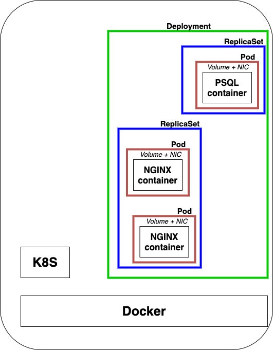

# Architecture terminology

**Kubectl** is the CLI to configure Kubernetes and manage apps.

A **node** is a single server in the Kubernetes cluster.

**Kubelet** is the name of the Kubernetes agent which will run on nodes.

**Control Plane** is the set of containers that manage the cluster. If you have one server, the control plane will also be called "master". However, if you have several servers and several masters, the Control Plane can be defined as the grouping of masters.

**Kubernetes** is also often written **k8s**, and since it is shorter, I'll use this name.

**K8S** is a series of containers, CLIs and configurations.

## Master

A master runs on top of Docker (or some other container runtime). Inside of a master, several containers run to keep control of the system :

- **etcd** : a distributed storage system for key values. It stores configuration data and more.
- **API** : allows to talk to the cluster and manage various stuff.
- **Scheduler** : will control how and where containers are placed on the nodes.
- **Controller Manager** : looks at the state of the whole cluster and at the containers running inside (using the API). It's a loop which figures out to make things happen just as you asked it.
- **CoreDNS** : manage DNS inside a cluster.

## Node(s)

On a node, an agent is running called **kubelet**. There's also a service/container called **kube-proxy** to control the network.

## Vocabulary

- **Pod :** one or more containers running together on one Node. It's the basic unit of deployment, containers are always in pods.
- **Controller :** for creating/updating pods and other objects. There are many types of controller (Deployment, Job, Cronjob, ReplicaSet, Daemon Set, etc).
- **Service :** is the persistent network endpoint of a set of pods.
- **Namespace** : a filtered group of objects in cluster. A just a filtering view, not a security feature. This is especially useful if you want to avoid hostname clashes.

## Relation between objects

Pods -> ReplicaSet (Controller) -> Deployment (Controller)

