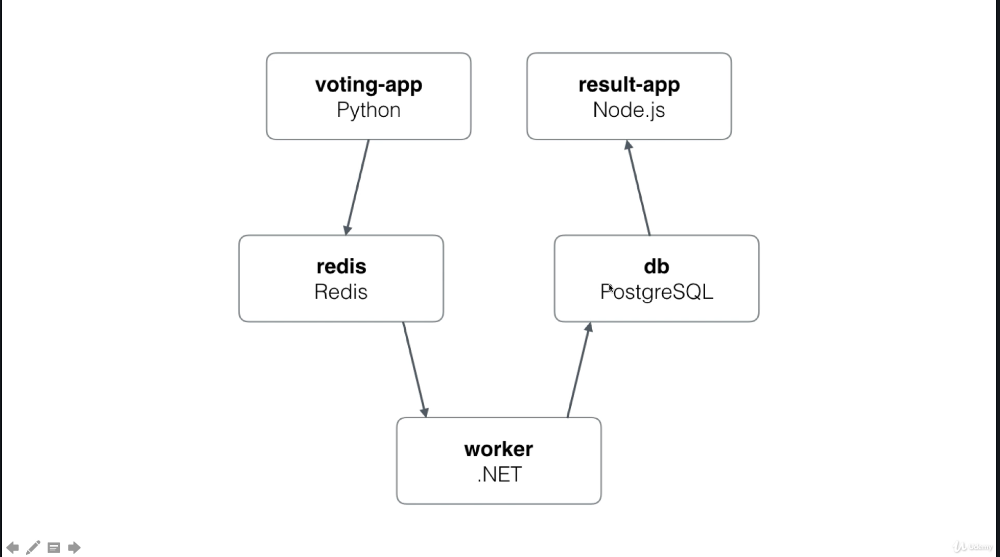

# Stack (this is cool)

Using docker-compose files for production, through Swarm :)

However, you won't be able to use the `build` key, that's not the idea. You'll have to pull your images from your container registry.

Swarm uses an extray `deploy` key, which is ignored by compose.

## Practice

Let's just reconsider this : 

Now have a look at `../stackfiles/multi-services-realcase-1.yml)`

and deploy using 
`docker stack deploy -c multi-services-realcase-1.yml voteapp`

You can also stop it using
`docker stack rm voteapp`